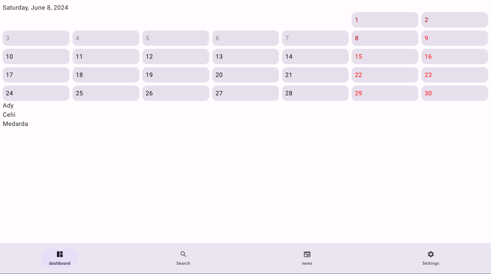

### English

1. To use an external API for news, you must first create an account at https://newsapi.org/register.

   

2. After creating the account, we will receive an API key, which should be completed in the application in the file /app/src/main/java/pl/mobilespot/futuremirror/core/utils/Constants.kt in line 6 -> const val API_KEY = "".

   

### Screenshots

#### Dashboard

By default, today's name day is displayed.

Click Settings in navigation bottom menu.

#### Settings

Enable option: Show Past Days.
And back to dashboard.

#### Dashboard With Option: Show Past Days

Click any day on calendar.

#### Dashboard with selected day will show the name day for the selected day. 

Click Search in navigation bottom menu.

#### Search

And enter a name to find the day and month for your name day.

Click News in navigation bottom menu.

#### News

