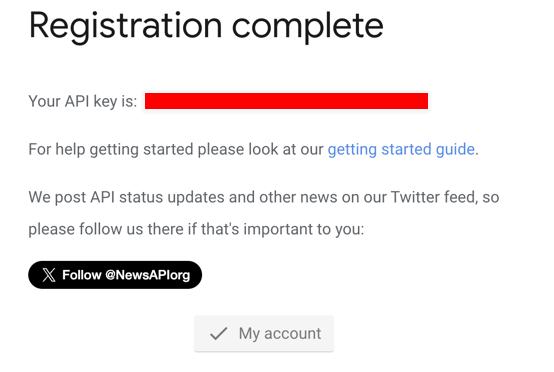
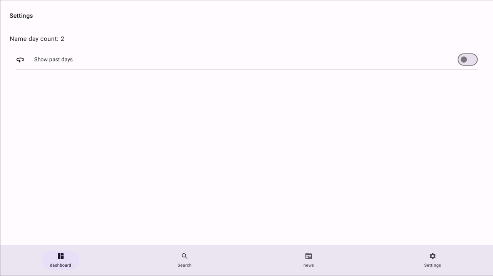
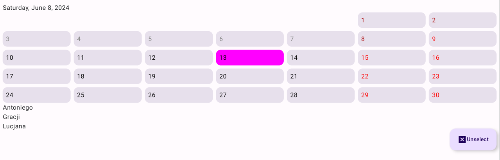

### Polski

1. Aby korzystać z zewnętrznego api dla wiadomości to należy najpierw na stronie https://newsapi.org/register stworzyć konto.

   

2. Po stworzeniu konta otrzymamy klucz API, który należy uzupełnić w aplikacji w pliku /app/src/main/java/pl/mobilespot/futuremirror/core/utils/Constants.kt w linijce 6 ->  const val API_KEY = "".

   

### Zrzuty ekranu

#### Dashboard 

Domyślnie wyświetlane są dzisiejsze imieniny.

Kliknij w Ustawienia w dolnym menu nawigacji.
#### Ustawienia  

Włącz opcję: Pokaż poprzednie dni.
Następnie wróc do dashboardu.

#### Dashboard z opcją: Pokaż poprzednie dni

Kliknij na dowolny dzień w kalendarzu.

#### Dashboard z zaznaczonym dniem pokaże imieniny dla wybranego dnia. 

Kliknij w Szukaj w dolnym menu nawigacji.

#### Szukaj 

Wpisz imię, aby znaleźć dzień i miesiąc imienin dla podanego dnia.

Kliknij w Wiadomości w dolnym menu nawigacji.

#### Wiadomości

